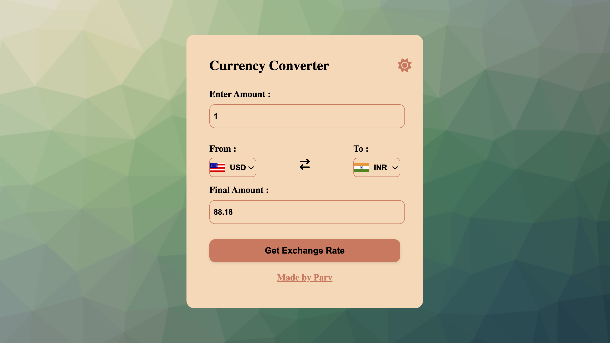
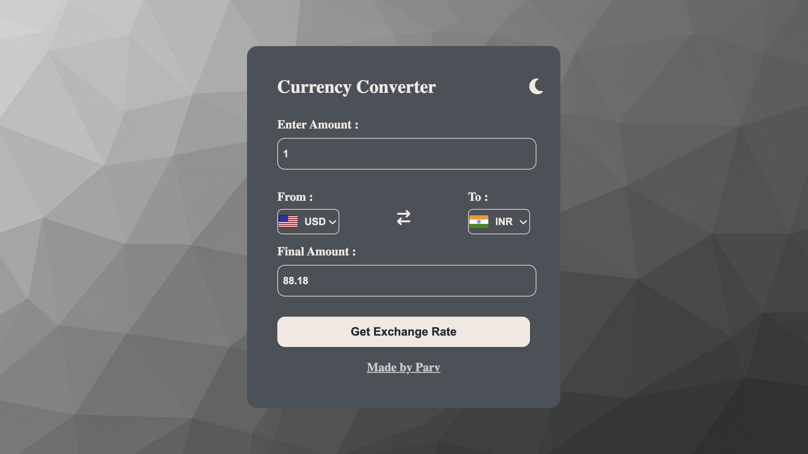
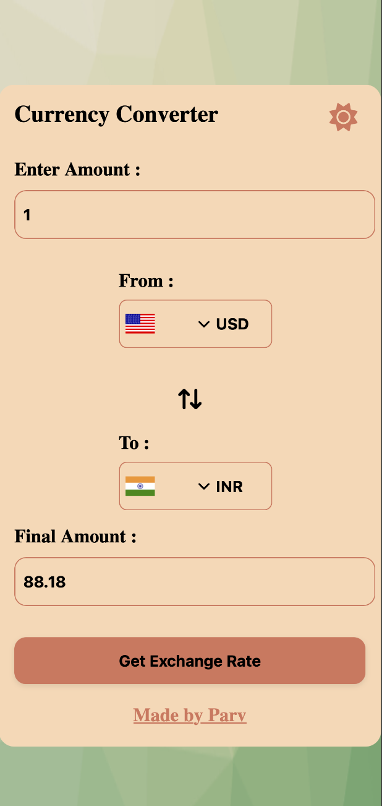
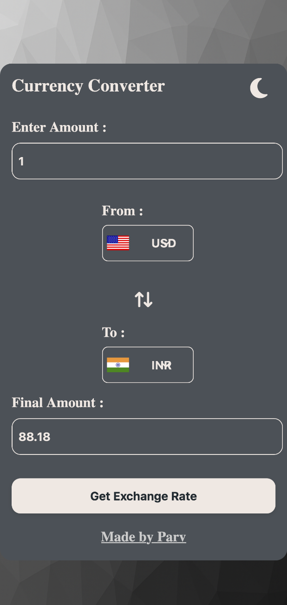
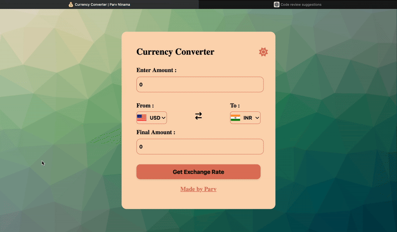
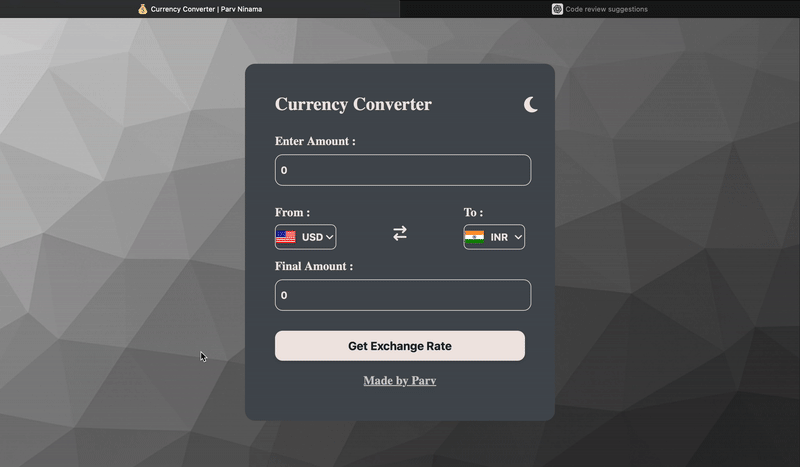

##  Currency Converter

Effortlessly convert currencies in real time with a smooth, flag-powered interface.  
This sleek, responsive web app brings you live exchange rates, an elegant light/dark theme toggle, and a polished user experience — right in your browser.


<p align="center">
  
</p>


##  Features

-  Convert between over 150 currencies
-  Live exchange rates using the [Fawaz Ahmed Currency API](https://github.com/fawazahmed0/currency-api)
-  Fully responsive design for mobile and tablets
-  Light/Dark theme toggle
-  Input validation with user-friendly messages
-  Country flags update dynamically based on selected currency

---

##  Live Demo

 [Try the Currency Converter](https://parvninama.github.io/currency-converter/)

---

##  Built With

- **HTML5**
- **CSS3**
- **JavaScript (ES6)**
- [Font Awesome](https://fontawesome.com/)
- [FlagsAPI](https://flagsapi.com/)
- [Currency API by Fawaz Ahmed](https://github.com/fawazahmed0/currency-api)

---

##  Folder Structure

```
currency-converter/
├── screenshots/        # Demo images & GIFs
├── index.html          # Main HTML file
├── styles.css          # CSS (light/dark, responsive)
├── app.js              # JS logic (API, theme toggle)
├── codes.js            # Country code + flag logic
├── README.md           # Project info & demo
└── favicon.ico         # Browser tab icon
```
---

##  How It Works

1. User enters an amount and selects currencies
2. Live exchange rates are fetched via the API
3. Country flags update based on selection
4. Theme toggle switches between light and dark modes

---

##  Desktop View 

###  Light Mode


###  Dark Mode


##  Mobile View (Light & Dark Modes)

<table>
  <tr>
    <td align="center"><strong>☀️ Light Mode</strong></td>
    <td align="center"><strong>🌙 Dark Mode</strong></td>
    <p align="center"><i>Mobile layout adapts to both light and dark themes</i></p>
  </tr>
  <tr>
    <td></td>
    <td></td>
  </tr>
</table>

---

##  Accessibility

- Supports full **keyboard navigation** using the `Tab` key
- Custom **focus styles** (outline & glow) improve visibility
- Works in both **light and dark mode**

##  Tab Focus in Action

<table>
  <tr>
    <td></td>
    <td></td>
  </tr>
  <tr>
    <td align="center">Light Mode Focus</td>
    <td align="center">Dark Mode Focus</td>
  </tr>
</table>

---

##  License

This project is licensed under the **MIT License** — feel free to use, modify, and share!

---

##  Connect

Feel free to check out more of my work on  
👉 [Parv Ninama](https://github.com/parvninama)
